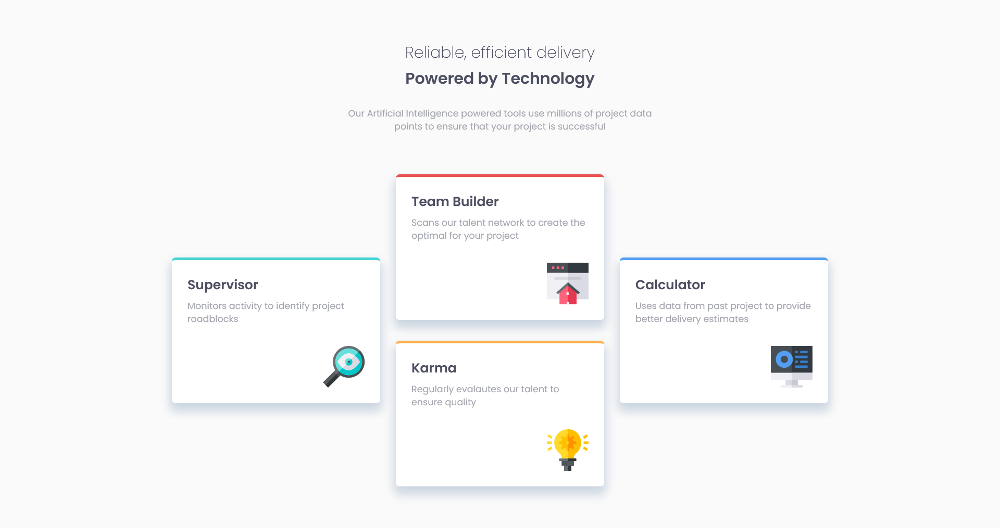

## Table of contents

-   [Overview](#overview)
    -   [Screenshot](#screenshot)
-   [My process](#my-process)
    -   [Built with](#built-with)
    -   [Useful resources](#useful-resources)

## Overview

### Screenshot

## My process

### Built with

-   Semantic HTML5 markup
-   CSS custom properties
-   Flexbox
-   Mobile-first workflow
-   [React](https://reactjs.org/) - JS library
-   [Vite](https://vitejs.dev/)
-   [Tailwind](https://tailwindcss.com/) - Css style

### What I learned

I improved myself on mobile-first design. I uploaded projects to github using Git. I improved myself on using Tailwind.
